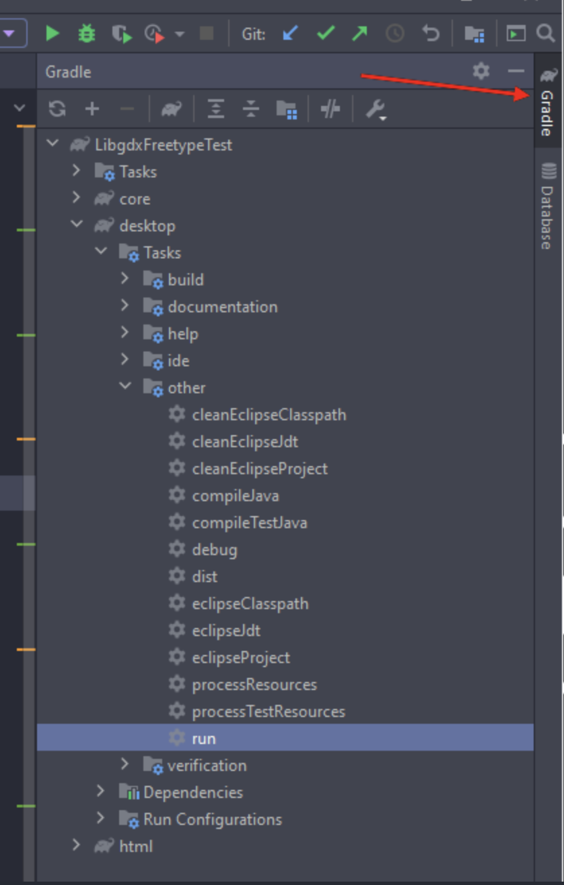

# Projinda

This is a semi open world 2D-platform game where you are playing as the thief with the goal of collecting coins, that turns into score. To win the game, you must survive the whole time and if you run out of lives, you lose. Compete against friends or even yourself to get the highest score.

## How to play
 **Movement**
   
    Arrow left: Move left

    Arrow right: Move right

    Arrow up: jump (double jump exist)

    Arrow down: dash down (if you dash down on an enemy, they'll take damage. 
    But beware, even you can take damage)

    Space (hold): sprint

**Features**

    s: shoot in the last moving direction

## How to run

- clone the repo

From here, you can choose two different paths: either run the program through intellij or the executable file.

### Executable file
- Open the cloned directory
- Loacate the "Thieves.exe"
- Run the located file

### Intellij

- Open intellij
- click file -> open
- go to the cloned repo and select the build.gradle file
- click open    
  When the build is complete, follow the instructions in the following picture:

  

  - Double click the marked run-command 

## Structure
This project uses the java library LibGdx, and is completely written in java.
